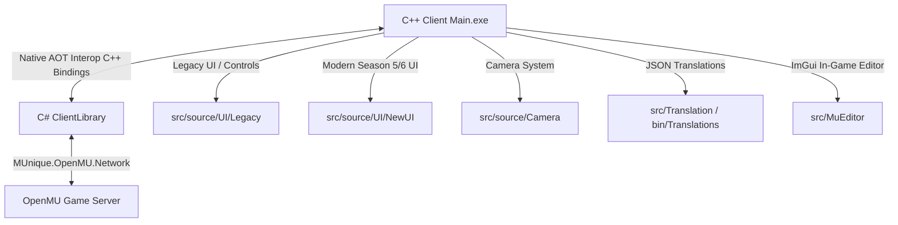

# LLM Developer Guide & Task Map

This file is a high-density reference guide designed specifically for Large Language Models (LLMs) and AI coding assistants (such as Antigravity, Claude Code, Cursor, and Copilot) to navigate this codebase efficiently, find files corresponding to specific developer tasks, and adhere strictly to repository conventions.

---

## 1. High-Level Repository Architecture

The project consists of a high-performance **MU Online Season 5.2/6 client** written in C++ and a **C# ClientLibrary** that handles the modern network stack via Native AOT interop.



### Core Architecture Layers:
1. **C++ Client (`src/source/`)**: Built using CMake, OpenGL (rendering), and SDL (windowing, audio, and input).
2. **C# ClientLibrary (`ClientLibrary/`)**: A C# library targeting .NET 10.0 that uses Native AOT (Ahead-of-Time) compilation to expose unmanaged C-style exports. It wraps the network protocol from `MUnique.OpenMU.Network`, manages socket connections, and decrypts/encrypts packages (SimpleModulus/Xor).
3. **Dotnet Interop Layer (`src/source/Dotnet/`)**: C++ side of the interop which imports functions exported by the C# Native AOT library and defines binding macros/headers.
4. **DevEditor (`src/MuEditor/`)**: Debug/Editor GUI compiled under `#ifdef _EDITOR` using ImGui (F12 to toggle, or `--editor` flag).
5. **i18n System (`src/Translation/` & `src/bin/Translations/`)**: Custom translation engine loading localized strings from JSON files.

---

## 2. Directory Task Map (Where to Look)

When assigned a specific task, use the following directory mapping to locate target files immediately:

| Developer Task | Relevant Directories & Files | Purpose & Description |
| :--- | :--- | :--- |
| **New UI Widgets & Windows** | [src/source/UI/NewUI/](src/source/UI/NewUI) | Layout, event handling, and logic for Season 5/6 HUD and components. |
| **HUD & Chat Log UI** | [src/source/UI/NewUI/HUD/](src/source/UI/NewUI/HUD) | Minimap, quick command, Gens rankings, chat logs, hotkeys, and main frame. |
| **Inventory, Trade, Vault & Mix** | [src/source/UI/NewUI/Inventory/](src/source/UI/NewUI/Inventory) | Inventory actions, extensions, item tooltips, equip limits, trade/storage, and lucky items. |
| **Legacy Windows** | [src/source/UI/Legacy/](src/source/UI/Legacy) | Backwards-compatible legacy UI components (`UIControls`, `UIWindows`, harmonies). |
| **Item Metadata & Inventory Data** | [src/source/Engine/Object/](src/source/Engine/Object) | Core client representations of items (`ZzzInventory.cpp`), character models, info rendering. |
| **Global Enums, Structs & Defines** | [src/source/Core/Globals/](src/source/Core/Globals) | Central C++ definitions, structures (`ITEM`, `OBJECT` in `_struct.h`), and enums (`_enum.h`). |
| **Gameplay Formulas & Skills** | [src/source/GameLogic/](src/source/GameLogic) | Combat logic, buffs, quest logic, pet rules, skill calculators, and NPC logic. |
| **Character Rendering & Class Data** | [src/source/Character/](src/source/Character) | Character selection screens (`CharSelMainWin.cpp`), creation grids, parts, and class stats. |
| **3D Camera & Controls** | [src/source/Camera/](src/source/Camera) | Projection math, camera modes (Default, Orbital, FreeFly), zoom limits, and frustum culling. |
| **DevEditor & Debug Tools** | [src/MuEditor/](src/MuEditor) | ImGui editor panels, camera overrides, Console logs (`MuEditorConsoleUI.cpp`), and input blocking. |
| **Translations & JSON Text** | [src/Translation/](src/Translation)<br>[src/bin/Translations/](src/bin/Translations) | i18n engine (`i18n.h` / `i18n.cpp`) and JSON files for localized strings (`game.json`, `editor.json`). |
| **Network Messages & Sockets** | [src/source/Network/Server/](src/source/Network/Server)<br>[ClientLibrary/](ClientLibrary) | Protocol definitions, packet parsers, WSclient socket management, and C# interop wrappers. |
| **OpenGL, Models & Terrain** | [src/source/Render/](src/source/Render) | C++ OpenGL vertex buffer layouts, BMD 3D models (`ZzzBMD.cpp`), textures, and particles. |
| **Audio & SFX** | [src/source/Audio/](src/source/Audio) | SDL Mixer sound effects and background music player. |
| **Map Assets & Terrains** | [src/source/World/](src/source/World) | Maps (`MapManager.cpp` in `MapInfra/`) and zone definitions (`GameMaps/`). |

---

## 3. High-Priority Files for Common Modding Tasks

### A. Modifying Item Tooltips, Stats & Background Colors
- **[ZzzInventory.cpp](src/source/Engine/Object/ZzzInventory.cpp) & [ZzzInventory.h](src/source/Engine/Object/ZzzInventory.h)**: Renders the item tooltips (`RenderItemInfo`), text list sizes, and side-by-side equippable comparisons.
- **[NewUIInventoryCtrl.cpp](src/source/UI/NewUI/Inventory/NewUIInventoryCtrl.cpp)**: Determines if an item is equippable by stats/class (`GetEquipStatus`) and sets tooltip frames (normal, red, yellow).

### B. Changing Combat Rules, Buffs, or Skill Calculations
- **[src/source/GameLogic/Combat/](src/source/GameLogic/Combat)**: Calculation of damage, critical rates, defense ratings, and formulas.
- **[src/source/GameLogic/Skills/](src/source/GameLogic/Skills)**: Custom behavior for active and passive skill sets.

### C. Modifying the 3D Camera, FOV, and Zoom Defaults
- **[CameraConfig.h](src/source/Camera/CameraConfig.h)**: Defines defaults for Default and Orbital cameras (far plane, FOV, culling widths).
- **[OrbitalCamera.cpp](src/source/Camera/OrbitalCamera.cpp)**: Handles the Orbital camera rotation limits, zoom calculations, and inputs.
- **[DefaultCamera.cpp](src/source/Camera/DefaultCamera.cpp)**: Standard third-person player follow camera behavior and zoom rungs.

### D. Extending the Network Protocol
- **[src/source/Network/Server/WSclient.cpp](src/source/Network/Server/WSclient.cpp)**: Direct packet receiver/processor on the C++ side.
- **[ClientLibrary/ConnectionManager.ClientToServerFunctions.cs](ClientLibrary/ConnectionManager.ClientToServerFunctions.cs)**: Outgoing packet definitions on the C# side.
- **[src/source/Dotnet/PacketFunctions_ClientToServer.cpp](src/source/Dotnet/PacketFunctions_ClientToServer.cpp)**: Interop bindings mapping C++ network triggers to the ClientLibrary C# exports.

### E. Adding Localized Text & UI Namespaces
- **[src/Translation/i18n.h](src/Translation/i18n.h)**: Macros `GAME_TEXT(key)`, `EDITOR_TEXT(key)`, and `META_TEXT(key, fallback)`.
- **[src/bin/Translations/en/game.json](src/bin/Translations/en/game.json)**: Main gameplay dictionary (always compiled).
- **[src/bin/Translations/en/editor.json](src/bin/Translations/en/editor.json)**: Editor translation dictionary (loaded only under `_EDITOR` build configuration).

### F. Minimap Click-to-Move & Navigation Math
- **[docs/map_navigation_movement.md](docs/map_navigation_movement.md)**: High-density mathematical reference and code-mapping guide for converting 2D isometric minimap clicks to `PathFinding2` grid targets and executing `SendMove` packets.

---

## 4. Key Global Structures (`src/source/Core/Globals/`)

LLMs must reference these files to understand the client's internal memory layout before mutating game structures:

- **[_struct.h](src/source/Core/Globals/_struct.h)**: Contains core engine structs:
  - `ITEM`: Describes an item in inventory/equipment (e.g. `Type`, `Level`, `Durability`, `SocketCount`, `SocketSeedID`).
  - `OBJECT`: Describes active entities on screen (monsters, players, effects, drops).
- **[_enum.h](src/source/Core/Globals/_enum.h)**: Lists all item types, equipment slot IDs (`EQUIPMENT_WEAR`), interface states (`INTERFACE_STATE`), and sound definitions. Keep enums and arrays synchronized.
- **[_define.h](src/source/Core/Globals/_define.h)**: System limits, window specs, math helpers, and hardcoded index rules.

---

## 5. Architectural Conventions & Style Guidelines

Every LLM generation must strictly satisfy the project constraints outlined in [docs/CODING_RULES.md](docs/CODING_RULES.md):

1. **Exit Early**: Place error guards at the top of functions. Prefer `if (bad) return;` over deep nesting.
2. **No Magic Numbers**: Give descriptive names to floats, colors, timers, and array offsets (use `const`, `constexpr`, or enums).
3. **One Class per File**: Separate new C++ classes into matching `.h`/`.cpp` files. C# bindings must keep one public type per file.
4. **Avoid Heap Allocations on Hot Paths**: In functions called per-frame (inside rendering loops, character updates, and vertex generation), **do not allocate memory on the heap** (avoid constructing `std::vector`, `std::string` or using `new`). Use stack allocation or static/thread-local buffers instead.
5. **Namespaces for Extracted Functions**:
   - Wrap extracted helper functions under namespaces structured as `<Layer>::<Concern>[::<SubConcern>]` (e.g., `UI::Skills::Tooltip::Render()`).
   - Omit the legacy `NewUI` prefix from new file names (e.g., name them `SkillTooltip.cpp`, not `NewUISkillTooltip.cpp`).
6. **Guard Against Leaks**: Always use C++ RAII / Smart Pointers (`std::unique_ptr`, `std::shared_ptr`) for custom allocations. Avoid manual `delete` chains.

---

## 6. Build & Debug Cheat Sheet

When preparing or testing code modifications, verify using these presets:

### CMake Build Presets (Run in Workspace Root)
- **Configure x86**: `cmake --preset windows-x86`
- **Build Debug Client**: `cmake --build --preset windows-x86-debug`
- **Build Release Client**: `cmake --build --preset windows-x86-release`
- **Clean Output Directory**: `Remove-Item -Recurse -Force out`

### Running the Client Locally
```powershell
# Run the local x86 debug client and connect to localhost
./out/build/windows-x86/src/Debug/Main.exe connect /u127.0.0.1 /p44406
```

### DevEditor Configuration
- Debug/Editor builds define `_EDITOR` and are configured with `ENABLE_EDITOR=ON`.
- Launching with the `--editor` flag opens the client with the tuning UI visible immediately.
- In-game, developers can press **F12** to toggle the ImGui editor overlay to live-tune cameras, frustum culling boundaries, graphics modes, and diagnostics.
