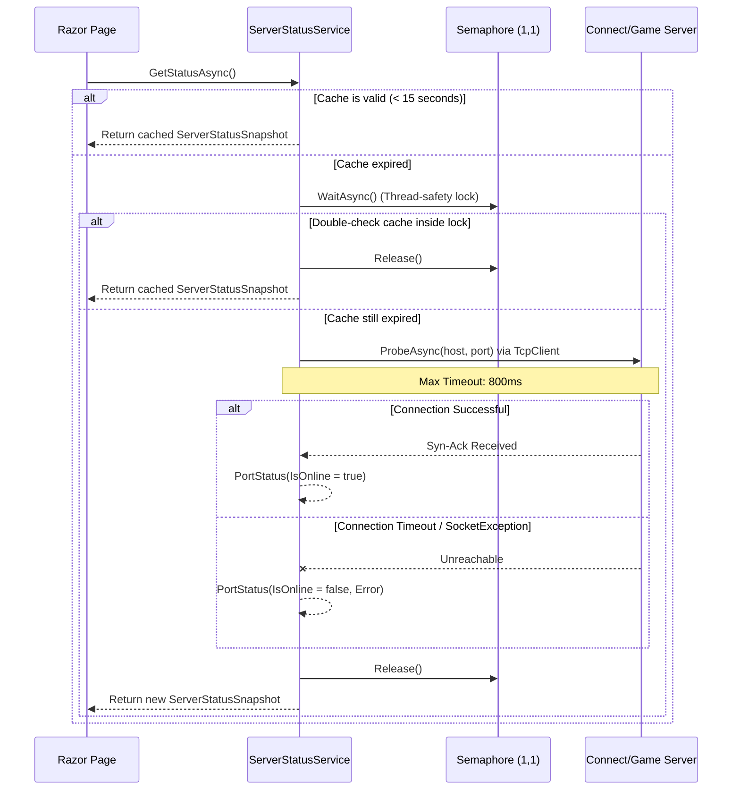
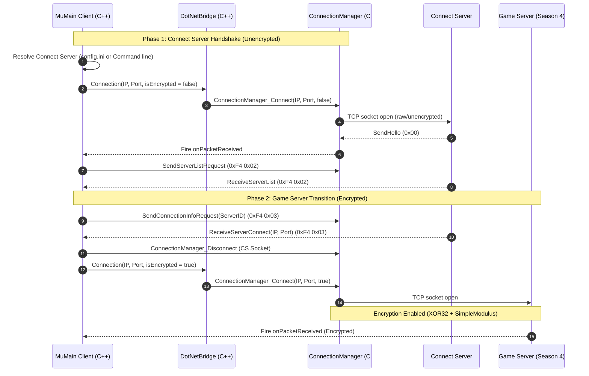

# MuMain & BarnaMu — Comprehensive Connection & Architecture Mapping

This document provides a comprehensive technical mapping of all connection and network architecture logic implemented across the **BarnaMu Web Portal** (`BCNMuWeb`) and the **MuMain Game Client**.

## Part I: BarnaMu Web Server Connection Architecture

To ensure high performance, ease of hosting, and total portability, the web application's architecture is completely **decoupled** from the core OpenMU game server and persistence assemblies. It communicates using direct socket-level TCP probing for server health, and native ADO.NET (`Npgsql`) combined with a high-performance micro-ORM (`Dapper`) to run parameter-safe, ultra-fast queries directly against the game database.

---

## 1. High-Level Connection Architecture

The application handles two main categories of network connections:

1. **Server Status Probing (TCP Sockets)**: The web server acts as a TCP client to query the game's **Connect Server** and **Game Servers** to check if they are online.
2. **Database Interaction (PostgreSQL Pool)**: The web server runs standard connection pools to execute account creations, updates, rankings, and bug reports.

```mermaid
graph TD
    subgraph Web Server (ASP.NET Core / Razor Pages)
        Config[appsettings.json / appsettings.Local.json] --> Options[BarnaMuOptions]
        SSS[ServerStatusService.cs] -->|TCP Sockets Probe| CS[Connect Server / Game Server]
        BMD[BarnaMuDb.cs] -->|Npgsql + Dapper| DB[(PostgreSQL Database)]
    end

    subgraph MU Online Game Infrastructure
        CS[Connect Server / Game Server]
        DB
    end

    Client[Game Client / Players] -->|Connects To| CS
    Client -->|Launches| Website[Web Server UI]
```

---

## 2. Configuration & Option Binding

All connection configuration keys are declared under the `BarnaMu` namespace within the standard configuration hierarchy.

### A. Configuration Files
* **Primary Config (`appsettings.json`)**: Contains standard templates and public address details.
* **Local Override (`appsettings.Local.json`)**: Merged at runtime but excluded from version control (Git). This houses sensitive local passwords, allowing the code to be safely pushed to public Git repositories without risk of leak.

#### Key Configuration Section (`appsettings.json`)
```json
"BarnaMu": {
  "ConnectionString": "Host=localhost;Port=5432;Database=openmu;Username=postgres;Password=REEMPLAZAR;Include Error Detail=true",
  "ConnectHost": "barnamu.ddns.net",
  "ConnectPort": 44405,
  "GameServerHost": "barnamu.ddns.net",
  "GameServerPorts": [ 55901 ]
}
```

### B. Runtime Application Startup (`Program.cs`)
During startup, the application merges the configuration files, binds the settings to a strongly-typed options object, and registers the connection handlers as singletons:

```csharp
// 1. Load Git-ignored developer/local environment overrides
builder.Configuration.AddJsonFile("appsettings.Local.json", optional: true, reloadOnChange: true);

// 2. Bind BarnaMu options section
builder.Services.Configure<BarnaMuOptions>(builder.Configuration.GetSection("BarnaMu"));

// 3. Register thread-safe singletons
builder.Services.AddSingleton<BarnaMuDb>();
builder.Services.AddSingleton<ServerStatusService>();
```

### C. Configuration Data Transfer Object (`Data/BarnaMuOptions.cs`)
Settings are bound into `BarnaMuOptions` for clean dependency injection (`IOptions<BarnaMuOptions>`) across pages and services:

* **`ConnectionString`**: Standard PostgreSQL connection string.
* **`ConnectHost` / `ConnectPort`**: Fully qualified domain name/IP and port for the Connect Server (Default: `barnamu.ddns.net` on port `44405`).
* **`GameServerHost` / `GameServerPorts`**: Host name and list of integer ports representing the game servers running in the cluster (e.g. `55901` for GameServer 1).

---

## 3. TCP Server Status Probing (`ServerStatusService.cs`)

The website displays a live status widget indicating whether the game's servers are online. Rather than checking a database heartbeat, the server conducts direct TCP handshake probes.



### Key Technical Implementations

#### 1. Rate Limiting & Concurrency Control
To prevent socket exhaustion and protect the Connect/Game servers from denial-of-service style socket hammering (especially under high web-traffic loads):
* **Thread-Safety**: Utilizes a `SemaphoreSlim _gate = new(1, 1)` to serialize execution. Only one probe operation runs concurrently.
* **Response Caching**: Successful and failed probes are cached for **15 seconds** (`CacheDuration`). Subsequent concurrent page views resolve instantly from memory, avoiding multiple redundant connections.

```csharp
private static readonly TimeSpan CacheDuration = TimeSpan.FromSeconds(15);
private static readonly TimeSpan ProbeTimeout = TimeSpan.FromMilliseconds(800);
```

#### 2. Timeout Mitigation
Standard TCP connection attempts can hang for up to 20-30 seconds depending on the OS TCP handshake timeout configuration.
* To avoid locking up web server worker threads, `ServerStatusService.cs` strictly restricts the probe duration to **800 milliseconds** using a `CancellationTokenSource`.

```csharp
using var client = new TcpClient { 
    ReceiveTimeout = (int)ProbeTimeout.TotalMilliseconds, 
    SendTimeout = (int)ProbeTimeout.TotalMilliseconds 
};
using var cts = new CancellationTokenSource(ProbeTimeout);
await client.ConnectAsync(host, port, cts.Token).ConfigureAwait(false);
```

#### 3. Graceful Error & Exception Containment
If a game server crashes, gets firewalled, or is offline:
* **Timeout Exception**: Catches `OperationCanceledException` and flags the server's error message as `"timeout"`.
* **Socket/Network Exceptions**: Catches generic exceptions (e.g., `SocketException` or `ConnectionRefused`), logs them silently under `LogDebug` (to prevent log spamming in production), and records the exception name (`ex.GetType().Name`) as the server status error.
* **Robust Return**: An offline server **never** throws an unhandled exception or blocks page rendering. The page receives a snapshot with `IsOnline = false`, rendering a clean visual status badge.

---

## 4. Database Connections & Transaction Pooling (`BarnaMuDb.cs`)

All persistent data actions are handled by `BarnaMuDb.cs`. 

### A. Connection Pooling & Disposal
Instead of maintaining a persistent open socket to the PostgreSQL database (which causes memory leaks, connection exhaustion, and transaction locking), connections are transient:

```csharp
private IDbConnection Open()
{
    var conn = new NpgsqlConnection(this._options.ConnectionString);
    conn.Open();
    return conn;
}
```
* Connections are instantiated as local variables using C# `using` blocks:
  ```csharp
  using var conn = this.Open();
  ```
* Under the hood, **Npgsql connection pooling** keeps physical connections alive in a background pool. When a `using` block finishes, `conn.Dispose()` automatically releases the connection back to the Npgsql pool instead of closing it physically, achieving high transaction rates.

### B. Query Execution via Dapper
Rather than dragging heavy Object-Relational Mapper (ORM) assemblies like Entity Framework Core into this independent codebase, queries are executed via **Dapper** (a lightweight micro-ORM).
* SQL is written in parameterized, raw string formats, eliminating SQL Injection vulnerabilities:
  ```csharp
  await conn.ExecuteScalarAsync<int?>(
      """SELECT 1 FROM data."Account" WHERE LOWER("LoginName") = LOWER(@LoginName) LIMIT 1""",
      new { LoginName = loginName });
  ```

### C. Database Schemas Queried
The class executes queries against distinct schemas standard to an OpenMU database deployment:
1. **`data."Account"`**: For user authorization, password updates, and session status tracking.
2. **`data."Character"`**: For character information, resets, level data, and profile views.
3. **`guild."Guild"` & `guild."GuildMember"`**: To assemble guild leaderboards and ranking statistics.
4. **`config."CharacterClass"`**: To resolve numeric ID references to localized class names (e.g., *Blade Knight*).
5. **`data."StatAttribute"`**: Holds character attributes indexed by stable, hardcoded GUID definitions corresponding to base OpenMU logic:
   - **Reset Count**: `89A891A7-F9F9-4AB5-AF36-12056E53A5F7`
   - **Base Level**: `560931AD-0901-4342-B7F4-FD2E2FCC0563`
   - **Master Level**: `70CD8C10-391A-4C51-9AA4-A854600E3A9F`

### D. Session Status Tracking (Active Players Online)
Instead of monitoring heartbeats or relying on separate memory stores, the website calculates active online players in a highly reliable, stateless way:
* When a player logs in and plays, OpenMU sets the `"State"` column in the `data."Account"` table to a non-zero value. When the player logs off, it is set back to `0` (Normal/Offline).
* **Online Player Count Query**:
  ```sql
  SELECT COUNT(*) FROM data."Account" WHERE "State" != 0 AND "IsTemplate" = false
  ```

### E. DB Failure Handling & Exception Mitigation

#### 1. Registration Race Conditions
If two users try to register the exact same username at the same millisecond:
* The unique constraint on the database acts as the source of truth.
* `CreateAccountAsync` handles this safely by catching `PostgresException` with the SQL unique violation code (`23505`) and mapping it to a controlled enum, preventing internal database stack traces from leaking to the frontend.

```csharp
catch (PostgresException pgex) when (pgex.SqlState == PostgresErrorCodes.UniqueViolation)
{
    // Race between AccountExistsAsync check and INSERT — the database constraint prevents duplicate data
    return AccountCreateResult.AlreadyExists;
}
```

#### 2. Isolation of Web Schema
The website features a bug reporting system. To avoid altering or breaking the core OpenMU schema structures, the website establishes its own isolated **`web`** schema and **`BugReport`** table:

```csharp
public async Task EnsureWebSchemaAsync()
{
    try
    {
        using var conn = this.Open();
        await conn.ExecuteAsync(
            """
            CREATE SCHEMA IF NOT EXISTS web;

            CREATE TABLE IF NOT EXISTS web."BugReport" (
                "Id"         bigserial PRIMARY KEY,
                "Reporter"   text       NOT NULL,
                "Email"      text       NULL,
                "Title"      text       NOT NULL,
                "Body"       text       NOT NULL,
                "CreatedAt"  timestamptz NOT NULL DEFAULT now(),
                "Ip"         text       NULL,
                "UserAgent"  text       NULL,
                "Status"     text       NOT NULL DEFAULT 'new'
            );
            ...
            """);
    }
    catch (Exception ex)
    {
        // Fail-safe: logs a warning but DOES NOT crash the app.
        // If PostgreSQL permissions restrict DDL commands or table creation fails, 
        // the registration, rankings, and landing pages will remain 100% active.
        this._logger.LogError(ex, "Could not ensure the web schema. Bug reports will not be saved.");
    }
}
```

#### 3. Security Shielding on Database Outage
If the PostgreSQL server goes completely offline:
* Any call to `this.Open()` throws an exception.
* All methods (e.g. `ValidateLoginAsync`, `CreateAccountAsync`, `GetTopByResetsAsync`) catch these anomalies gracefully using `try-catch` blocks, logging the incident with a secure trace message using `ILogger` while returning failure enums (e.g. `AccountCreateResult.Error` or `null`) to the Razor page.
* This ensures that database outages never display raw connection details, local paths, or connection credentials to website visitors.

---

## Part II: Game Client Connection Architecture (MuMain Game Client)

The **MuMain Game Client** uses a hybrid architecture combining high-performance C++ game loops with a modular C# (.NET) network transport layer via a CoreCLR/NativeAOT bridge. This architecture ensures high-speed packet processing, seamless transition between map servers, and secure data encryption.



### 1. Initial Server IP & Port Resolution
The game client determines the address of the Connect Server during startup (`Winmain.cpp`) in a tiered fallback structure:
* **Command Line Overrides**:
  - The launcher can launch the client with `/u` (URL/IP) and `/p` (Port) arguments (e.g., `/u barnamu.ddns.net /p 44405`).
  - Parsed by `GetConnectServerInfo` in `Winmain.cpp` using the `Util_CheckOption` helper to capture both uppercase/lowercase switch values.
* **Configuration File (`config.ini`)**:
  - If no command-line flags are found, settings are loaded from `config.ini` in the executable's directory via the `GameConfig` class.
  - Parsed from the `[CONNECTION SETTINGS]` section using `ServerIP` (default: `127.0.0.1`) and `ServerPort` (default: `44406`).
* **Hardcoded Fallback Defaults**:
  - If both the command line and INI files are missing, the client falls back to `SceneCore.cpp` defaults:
    - IP: `127.0.0.1`
    - Port: `44406`

### 2. CoreCLR / NativeAOT Bridge (`MUnique.Client.Library.dll`)
Rather than rewriting high-level networking and security features in C++, the client loads a compiled C# library (`MUnique.Client.Library.dll`) at runtime:
* The C++ class `Connection` (`Dotnet/Connection.cpp`) dynamically loads CoreCLR unmanaged entry points using the `LoadManagedSymbol` routine:
  - `ConnectionManager_Connect`
  - `ConnectionManager_Send`
  - `ConnectionManager_BeginReceive`
  - `ConnectionManager_Disconnect`
* Pointers to C++ unmanaged static handlers (`OnPacketReceivedS` and `OnDisconnectedS`) are passed to the C# layer to handle incoming network payloads asynchronously without blocking the main rendering thread.

### 3. Connection Encryption Determination (Port Range Strategy)
When `CreateSocket(IpAddr, Port)` is executed in `WSclient.cpp`, it determines whether to apply encryption based on a hardcoded port range constraint:
```cpp
const bool isEncrypted = Port > 0xADFF || Port < 0xAD00;
```
* **Unencrypted Range (`[44288, 44543]` / `[0xAD00, 0xADFF]`)**:
  - Connect Servers (e.g., port `44405` / `44406`) fall within this range.
  - The C# library establishes a **raw, unencrypted socket**. Packets are transmitted in plain-text byte arrays.
* **Encrypted Range (outside of the unencrypted boundaries)**:
  - Game Servers (e.g., port `55901`) fall outside this range.
  - The C# library initializes `PipelinedXor32Encryptor`, `PipelinedSimpleModulusEncryptor`, and `PipelinedSimpleModulusDecryptor` pipelines. All communications are encrypted using standard Season 4 client-side keys (`DefaultClientKey`).

### 4. Connect Server to Game Server Transition Loop
The handshake process proceeds in a stateless connection loop managed by `WSclient.cpp`:
1. **Connect Server Connection**:
   - The client connects to the Connect Server port (e.g., `44406`, unencrypted).
   - Once connected, it receives `Hello` and automatically sends `ServerListRequest` (via the C# wrapper).
   - It receives a `ServerListResponse` which populates the server selection window (`m_ServerSelWin`), mapped dynamically by layout parameters read from the decrypted `Data\Local\ServerList.bmd` file.
2. **Game Server Handshake**:
   - When the user selects a server group/instance, the client sends a `ConnectionInfoRequest` with the `serverId`.
   - The Connect Server returns a `ConnectionInfo` packet containing the IP address and Port of the targeted Game Server.
   - The client handles this in `ReceiveServerConnect` in `WSclient.cpp`:
     1. Closes the existing socket to the Connect Server (`SocketClient->Close()`).
     2. Calls `CreateSocket(IP, Port)` for the new server.
     3. Since the Game Server port lies outside the unencrypted range, the socket is established with encryption enabled.
     4. `g_bGameServerConnected` is set to `TRUE`, and the client displays the Login Window (`m_LoginWin`).

### 5. Map Server Changing (Cross-Server Map Movement)
When a player changes maps or joins a specialized instance (such as changing to a PvP map or event server):
* The active Game Server issues a map server change redirect packet.
* The C++ class `CSMapServer` (`Network/Server/CSMapServer.cpp`) processes the map redirect:
  - Closes the active Game Server connection.
  - Initiates a new connection to the target server's IP and Port using `CreateSocket(ipAddress, m_serverInfo.m_wMapSvrPort)`.

